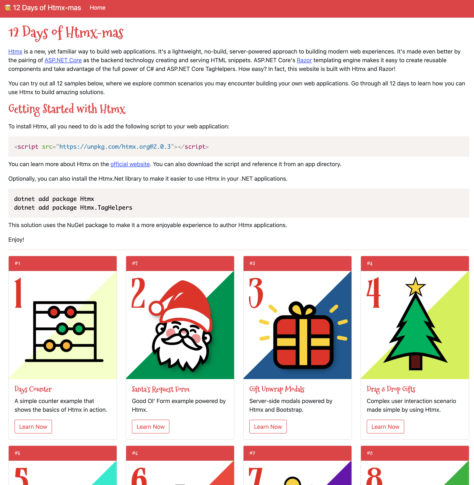

This is a Christmas themed ASP.NET Core application with 12 demos showing
how developers can leverage Htmx in their web solutions. These are 12 common
patterns you may apply to your existing applications that can improve the
user experience with only minor changes to your backend code.

Htmx is a "no-build" solution, so you won't need complex JavaScript toolchains or
to adopt any new framework just to add some new functionality to existing applications.

Give it a try!

## Getting Started

You will need [.NET 8 SDK](https://dot.net) and an IDE like [JetBrains Rider](https://jetbrains.com/rider). That's it!

## Acknowledgments

Many of the initial art elements are adapted from [The Noun Project](https://thenounproject.org) which I am
a member. While the code is provided under MIT, I'm not sure about the images themselves as I cannot extend
their licensing to you.
